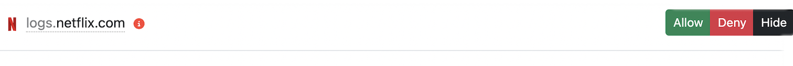
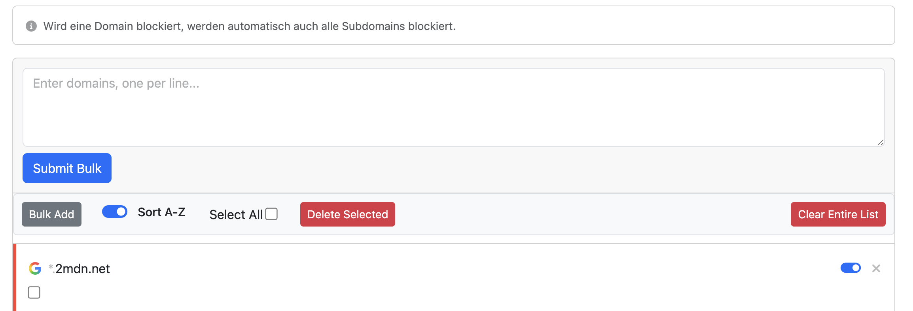
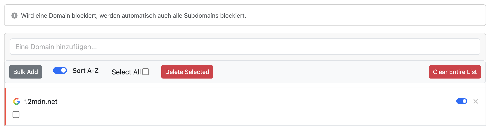
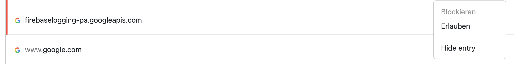
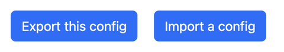
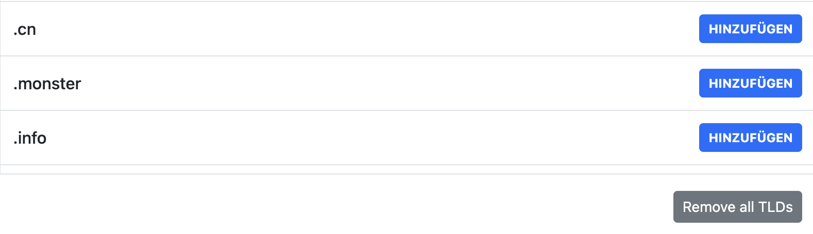

# ReNXEnhanced

**ReNXEnhanced** is a lightweight, modernized userscript for [NextDNS](https://my.nextdns.io), based on the original ["NXEnhanced"](https://github.com/hjk789/NXEnhanced) by @hjk789. This fork (maintained at [github.com/henosch/ReNXEnhanced](https://github.com/henosch/ReNXEnhanced)) adds powerful management features, interface improvements, and performance optimizations for large configurations.

[English](#english) | [Deutsch](#deutsch)

---

## English

**ReNXEnhanced** adds quality-of-life features to the NextDNS dashboard, making it easier to manage allowlists, denylists, security settings, and logs.

### ✅ Compatibility
- **Tested with:** Google Chrome, Apple Safari (macOS)
- **Userscript Manager:** Tampermonkey (recommended), Violentmonkey

### 🚀 Installation
1. Install a Userscript Manager (Tampermonkey for Chrome/Edge/Safari, or Userscripts on iOS/macOS).
2. [**Click here to install the script**](https://github.com/henosch/ReNXEnhanced/raw/main/ReNXEnhanced.user.js).
3. Confirm the installation in your manager.
4. Refresh your NextDNS dashboard.

### ✨ Features
- **Bulk Operations**
  - Bulk Add with live progress & deduplication (skips existing domains, even wildcards).
  - Bulk Delete with checkbox selection, rate-limit safeguards, and confirmations.
  - Clear Entire List handles tens of thousands of entries with verification + auto reload.
- **Sorting & Organization**
  - Sort A-Z by root domain so subdomains group together (`*.ads.example.co.uk → example.co.uk`).
  - Persistent description fields for per-domain notes stored in the browser.
- **Logs**
  - Inline Allow/Deny/Hide buttons for every entry plus persistent hiding controls.
  - “Reset Hidden Domains (N)” button shows how many entries are hidden.
- **Security / Privacy**
  - Blocklists sortable A-Z inside modals.
  - “Remove all TLDs” helper clears the TLD blocklist with confirmation.
- **Stability & UX**
  - Automatic retries for HTTP 429 with exponential backoff.
  - Optimizations for huge lists to avoid browser hangs.

### 🖼️ Screenshots
| |
| --- |
|  |
| Inline Allow/Deny/Hide buttons appear beside every log entry without opening the menu. |
|  |
| Bulk Add shows a live `current/total` counter while existing domains are skipped automatically. |
|  |
| Allow/Deny pages gain a toolbar with bulk commands, selection checkboxes, and sorting toggles. |
|  |
| The dropdown menu also receives the “Hide entry” option for users who prefer the menu workflow. |
|  |
| Settings view offers Export/Import buttons and quick actions. |
|  |
| Security page: a single button removes all TLD blocks after confirmation. |

---

## Deutsch

**ReNXEnhanced** ist eine aktualisierte Version des ursprünglichen ["NXEnhanced"](https://github.com/hjk789/NXEnhanced) von @hjk789 und wird unter [github.com/henosch/ReNXEnhanced](https://github.com/henosch/ReNXEnhanced) gepflegt. Das Skript erweitert das NextDNS-Dashboard um praktische Werkzeuge für Allow-/Denylisten, Sicherheitseinstellungen und Protokolle.

### ✅ Kompatibilität
- **Getestet mit:** Google Chrome, Apple Safari (macOS)
- **Userscript-Manager:** Tampermonkey (empfohlen), Violentmonkey

### 🚀 Installation
1. Userscript-Manager installieren (Tampermonkey für Chrome/Edge/Safari oder Userscripts auf iOS/macOS).
2. [**Hier klicken, um das Skript zu installieren**](https://github.com/henosch/ReNXEnhanced/raw/main/ReNXEnhanced.user.js).
3. Installation bestätigen.
4. NextDNS-Dashboard neu laden.

### ✨ Funktionen
- **Massenbearbeitung**
  - Bulk Add mit Fortschrittsanzeige & Duplikat-Erkennung (überspringt vorhandene Domains inkl. Wildcards).
  - Bulk Delete mit Checkbox-Auswahl, Sicherheitsabfrage und automatischer Drosselung.
  - „Liste leeren“ löscht riesige Listen zuverlässig (inkl. API-Verifikation und Auto-Reload).
- **Sortierung & Organisation**
  - Sort A-Z nach Hauptdomain, damit Subdomains zusammen gruppiert werden.
  - Persistente Beschreibungsfelder für eigene Notizen pro Domain.
- **Logs (Protokolle)**
  - Inline-Erlauben/Blockieren/Verstecken direkt neben jedem Eintrag.
  - „Reset Hidden Domains (Anzahl)“-Button zeigt, wie viele Einträge ausgeblendet sind.
- **Sicherheit/Privatsphäre**
  - Blocklisten lassen sich in den Modals alphabetisch sortieren.
  - Ein Knopf entfernt auf Wunsch sämtliche TLD-Einträge aus der Blockliste.
- **Stabilität**
  - Integrierter Schutz gegen „Rate Limits“ (HTTP 429) mit automatischer Wiederholung.
  - Optimiert für sehr große Listen, um Browser-Hänger zu vermeiden.

### 🖼️ Screenshots
| |
| --- |
|  |
| Drei Schnellbuttons (Allow/Deny/Hide) erscheinen direkt neben jedem Logeintrag. |
|  |
| Bulk-Add läuft mit Fortschrittsanzeige und überspringt automatisch vorhandene Domains. |
|  |
| Die neuen Werkzeugleisten bringen Bulk-Befehle, Auswahl-Checkboxen und Sortierschalter in die Allow-/Denylisten. |
|  |
| Das bestehende Menü erhält zusätzlich die Option „Hide entry“. |
|  |
| Im Einstellungsbereich lassen sich Konfigurationen exportieren oder importieren. |
|  |
| Sicherheitsbereich: Ein Button entfernt auf Wunsch alle TLD-Einträge aus der Blockliste. |

---

## 📜 License

Distributed under the MIT License. See `LICENSE` for more information.
